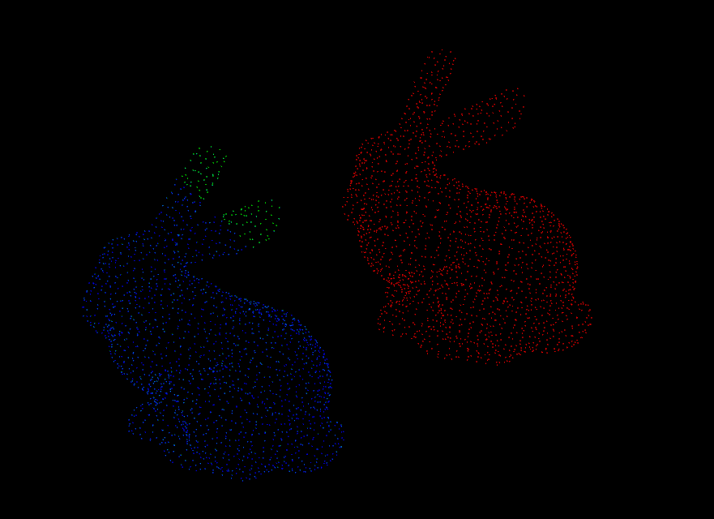

# Generalized ICP (G-ICP), Normal Distributions Transform (NDT), and TEASER++

- Load Velodyne lidar points from KITTI dataset.
- Perform G-ICP on the LiDAR points.
- Perform NDT on the LiDAR points.
- Perform [TEASER++](https://github.com/MIT-SPARK/TEASER-plusplus) on the LiDAR points.

---

# How to build & run

Requirement: PCL, TEASER++

## Local build

```
mkdir build && cd build
cmake ..
make -j
./gicp /data/kitti/sequences/00/velodyne
./ndt /data/kitti/sequences/00/velodyne
./teaser_plus_plus
```

## Docker build 

Requires base build

```
docker build . -t slam:4_8
docker run -it --env DISPLAY=$DISPLAY -v /kitti:/data/ -v /tmp/.X11-unix/:/tmp/.X11-unix:ro slam:4_8

# Inside docker container
cd fastcampus_slam_codes/4_8
./gicp /data/sequences/00/velodyne
./ndt /data/sequences/00/velodyne
./teaser_plus_plus
```

---

# Output

Red: Target point cloud
Green: Transformed point cloud (Not really visible, as the points lie behind the target point cloud)

> If you can see green point clouds, it would actually mean that the registration has not worked perfectly.

## G-ICP


## NDT


## TEASER++


---

# Fast-GICP

> Original repo: https://github.com/SMRT-AIST/fast_gicp

## How to build

```
docker build . -f Dockerfile_fast_gicp -t slam:fast_gicp
```

## How to run

```
xhost +local:docker
docker run -it --env DISPLAY=$DISPLAY -v /kitti:/data -v /tmp/.X11-unix/:/tmp/.X11-unix:ro slam:fast_gicp

# Inside docker container
cd fast_gicp/build
./gicp_kitti /data/sequences/00/velodyne
```

## Output


---

# CUDA accelerated FAST-GICP

## How to build

```
docker build . -f Dockerfile_fast_gicp_cuda -t slam:fast_gicp_cuda
```

## How to run

```
xhost +local:docker
docker run -it --env DISPLAY=$DISPLAY --privileged --runtime nvidia --gpus all -v /kitti:/data -v /tmp/.X11-unix/:/tmp/.X11-unix:ro slam:fast_gicp_cuda

# Inside docker container
cd fast_gicp/
vim src/kitti.cpp (And edit code line 86-91 to select your algorihtm)
cd build
make -j
./gicp_kitti /data/sequences/00/velodyne
```

## Output


---
