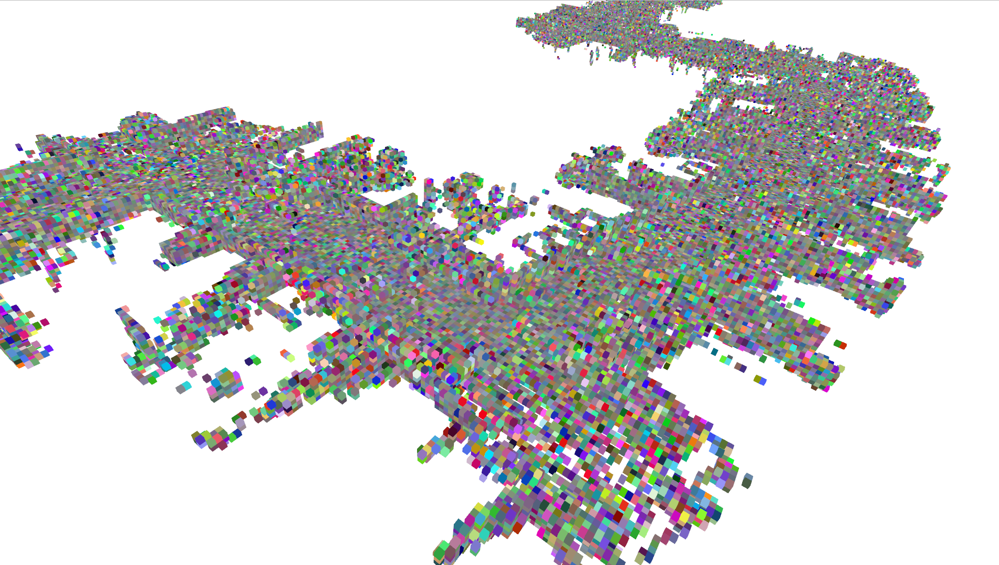

# Octree & Octomap & Bonxai

- Load a lidar point cloud datum from KITTI dataset
1. Perform octree-based nearest neighbor search
2. Make voxel map based on [Octomap](https://octomap.github.io) library
3. Fast voxel mapping using [Bonxai](https://github.com/facontidavide/Bonxai/tree/main) library, and visualize the map

---

# How to build & run

Requirement: PCL, Octomap

## Local build

```
mkdir build && cd build
cmake ..
make -j
./octree
./octomap
```

## Docker build 

Requires base build

```
docker build . -t slam:4_9
docker run -it --env DISPLAY=$DISPLAY -v `pwd`:/fastcampus_slam_codes/4_9 -v /tmp/.X11-unix/:/tmp/.X11-unix:ro slam:4_9

# Inside docker container
cd fastcampus_slam_codes/4_9
./octree
./octomap
```

---

# Output

## Octree


## Octomap


---

# Fast voxel mapping using [Bonxai](https://github.com/facontidavide/Bonxai/tree/main) library

## How to build & run

```
docker build . -f Dockerfile_bonxai -t slam:4_9_bonxai
docker run -it --env DISPLAY=$DISPLAY -v /kitti:/data -v /tmp/.X11-unix/:/tmp/.X11-unix:ro slam:4_9_bonxai

# Inside container
cd Bonxai/

# Visualization
pip3 install open3d numpy
python3 pcd_viewer.py bonxai_result.pcd
```

## Output

