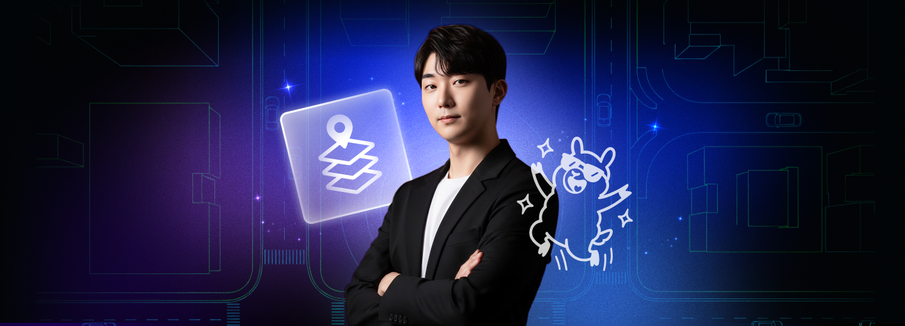

# fastcampus_slam_codes

This repository contains code exercises for the following lecture series provided by @changh95 at FastCampus:

- ['Computer Vision, LiDAR processing, and Sensor Fusion for Autonomous Driving'](https://fastcampus.co.kr/data_online_autovehicle)

- ['SLAM Zero-to-Hero series for Physical AI and 3D Computer Vision'](https://fastcampus.co.kr/data_online_slam)

