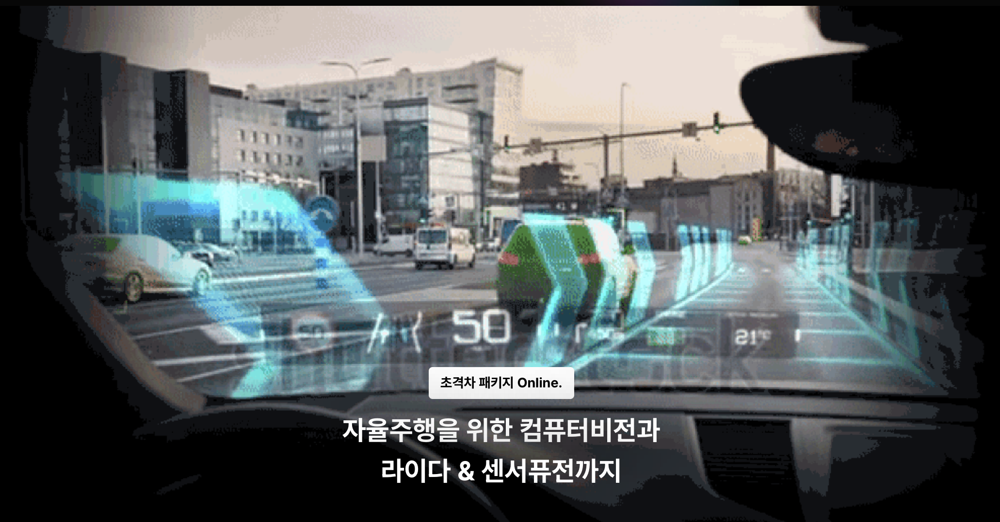

# fastcampus_slam_codes

This repository contains code exercises for the SLAM section in the lecture series - ['Computer Vision, LiDAR processing, and Sensor Fusion for Autonomous Driving'](https://fastcampus.co.kr/data_online_autovehicle) at FastCampus. This lecture series is delivered in Korean language.



## How to use

Most of the code exercises are based on the base docker image. The base docker image contains numerous C++ libraries for SLAM, such as OpenCV, Eigen, Sophus, PCL, and ceres-solver. 

You can build the base docker image using the following command. 

```shell
docker build . --tag slam:latest --progress=plain
```

## Table of contents

- Chapter 1: Introduction to SLAM
  - 1.1 Lecture introduction
  - 1.2 What is SLAM?
  - 1.3 Hardware for SLAM
  - 1.4 Types of SLAM
  - 1.5 Applications of SLAM
  - 1.6 Before we begin...
  - 1.7 [Basic C++ / CMake](1_7)
- Chapter 2: Introduction 3D Spaces
  - 2.1 3D rotation and translation
  - 2.2 [3D rotation and translation, using Eigen library](2_2)
  - 2.3 Homogeneous coordinates
  - 2.4 Lie Group
  - 2.5 Basic Lie algebra
  - 2.6 [Lie Group and Lie algebra, using Sophus library](2_6)
  - 2.7 How cameras work
  - 2.8 How LiDARs work
- Chapter 3: Image processing
  - 3.1 Local feature extraction & matching
  - 3.2 [Local feature extraction & matching, using OpenCV library](3_2)
  - 3.3 [Superpoint and Superglue, using C++ and TensorRT](3_3)
  - 3.4 Global feature extraction
  - 3.5 [Bag of Visual Words, using DBoW2 library](3_5)
  - 3.6 [Learning-based global feature extraction, using PyTorch and Tensorflow libraries](3_6)
  - 3.7 Feature tracking
  - 3.8 [Optical flow, using OpenCV library](3_8)
- Chapter 4: Point cloud processing
  - 4.1 Introduction to point cloud processing
  - 4.2 [Introduction to point cloud processing, using PCL library](4_2)
  - 4.3 Point cloud pre-processing
  - 4.4 [Point cloud pre-processing, using PCL library](4_4)
  - 4.5 Iterative closest point
  - 4.6 [Iterative closest point, using PCL library](4_6)
  - 4.7 Advanced ICP methods
  - 4.8 [Advanced ICP methods, using PCL library](4_8)
  - 4.9 [Octree, Octomap, Bonxai, using PCL/Octomap/Bonxai libraries](4_9)
- Chapter 5: Multiple view geometry
  - 5.1 Epipolar geometry
  - 5.2 [Essential and Fundamental matrix estimation, using OpenCV library](5_2)
  - 5.3 Homography
  - 5.4 [Bird's eye view (BEV) projection, using OpenCV library](5_4)
  - 5.5 [Simple monocular visual odometry, using OpenCV library](5_5)
  - 5.6 Triangulation
  - 5.7 [Triangulation, using OpenCV library](5_6)
  - 5.8 Perspective-n-Points (PnP) and Direct Linear Transform (DLT)
  - 5.9 [Fiducial marker tracking, using OpenCV library](5_8)
  - 5.10 RANSAC
  - 5.11 Advanced RANSAC methods (USAC)
  - 5.12 [RANSAC and USAC, using OpenCV and RansacLib libraries](5_12)
  - 5.13 Graph-based SLAM
  - 5.14 Least squares
  - 5.15 Schur complement
  - 5.16 Bundle adjustment
  - 5.17 [Bundle adjustment, using Ceres-Solver library](5_17)
- Chapter 6: Visual-SLAM
  - 6.1 Overview of feature-based VSLAM
  - 6.2 Overview of direct VSLAM
  - 6.3 Overview of visual-inertial odometry (VIO)
  - 6.4 Spatial AI
  - 6.5 [ORB-SLAM2](orb_slam2), [ORB-SLAM3](orb_slam3)
  - 6.6 [DynaVINS](dynavins)
  - 6.7 [CubeSLAM](cubeslam)
- Chapter 7: LiDAR SLAM
  - 7.1 Overview of 2D LiDAR SLAM
  - 7.2 Overview of 3D LiDAR SLAM and LiDAR-inertial odometry
  - 7.3 [HDL-Graph-SLAM](hdl_graph_slam)
  - 7.4 [KISS-ICP](kiss_icp)
  - 7.5 [SHINE-Mapping](shine_mapping)
- Chapter 8: CI/CD for SLAM
  - 8.1 TDD and tests
  - 8.2 CI/CD
  - 8.3 CI agents
  - 8.4 CI/CD for Python SLAM projects
  - 8.5 CI/CD for C++ SLAM projects
- Final projects:
  - DSP-SLAM
  - Suma++

## Acknowledgements

ORB-SLAM 2/3 authors, DynaVINS authors, CubeSLAM authors, HDL-Graph-SLAM authors, KISS-ICP authors, SHINE-Mapping authors, and all the authors of the libraries used in this repository.

