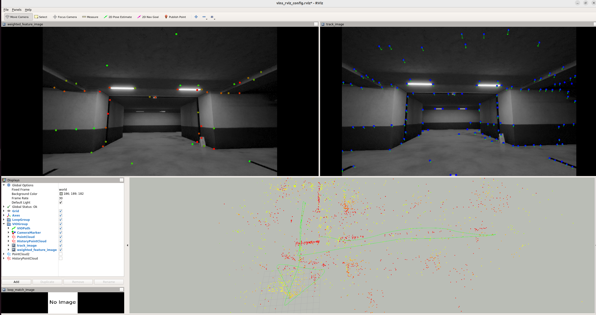

# DynaVINS

## How to build 

```
docker build . -t slam:dynavins
xhost +local:docker
xhost +local:root

# Open 2 terminals with the command below
docker run -it \
    --env="DISPLAY=$DISPLAY" \
    --env="QT_X11_NO_MITSHM=1" \
    --volume="/tmp/.X11-unix:/tmp/.X11-unix:rw" \
    --env="XAUTHORITY=$XAUTH" \
    --volume="$XAUTH:$XAUTH" \
    --runtime=nvidia \
    --volume="`pwd`:/data" --net=host --privileged slam:dynavins

# On the first terminal
roslaunch dynaVINS viode_mono.launch

# On the second terminal
rosbag play 3_high.bag
```

## Download dataset (VIODE dataset)

[http://gofile.me/4355j/XIv6xyQ2i](http://gofile.me/4355j/XIv6xyQ2i)

Extract the .bag files in the project folder

## Demo


