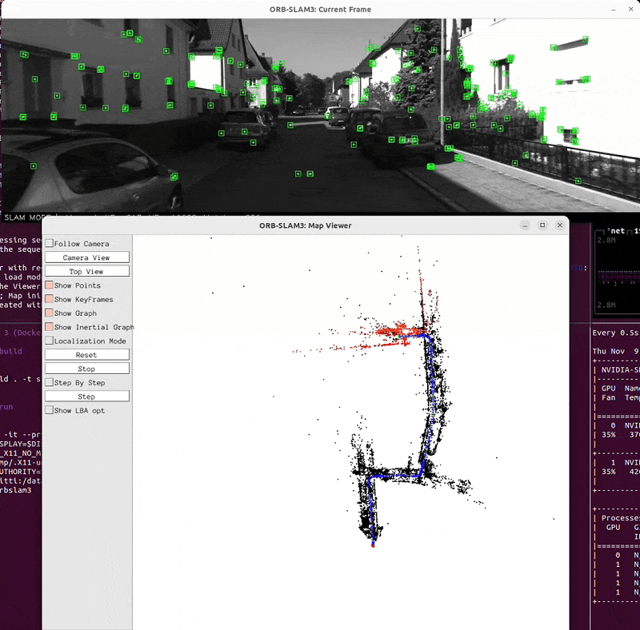

# ORB-SLAM 3 (Docker)

## How to build 

```
docker build . -t slam:orbslam3
```

## How to run 

```
docker run -it --privileged --net=host --ipc=host \
    -e "DISPLAY=$DISPLAY" \
    -e "QT_X11_NO_MITSHM=1" \
    -v "/tmp/.X11-unix:/tmp/.X11-unix:rw" \
    -e "XAUTHORITY=$XAUTH" \
    -v ~/kitti:/data \
    slam:orbslam3

# Inside docker (Mono)
cd ORB_SLAM3-1.0-release/Examples/Monocular
./mono_kitti ../../Vocabulary/ORBvoc.txt ./KITTI00-02.yaml /data/sequences/00

# Inside docker (Stereo)
cd ORB_SLAM3-1.0-release/Examples/Stereo
apt-get install -y vim
vim ./KITTI00-02.yaml (then, copy the contents of KITTI00_02_for_stereo.yaml)
./stereo_kitti ../../Vocabulary/ORBvoc.txt ./KITTI00-02.yaml /data/sequences/00
```

## Demo


